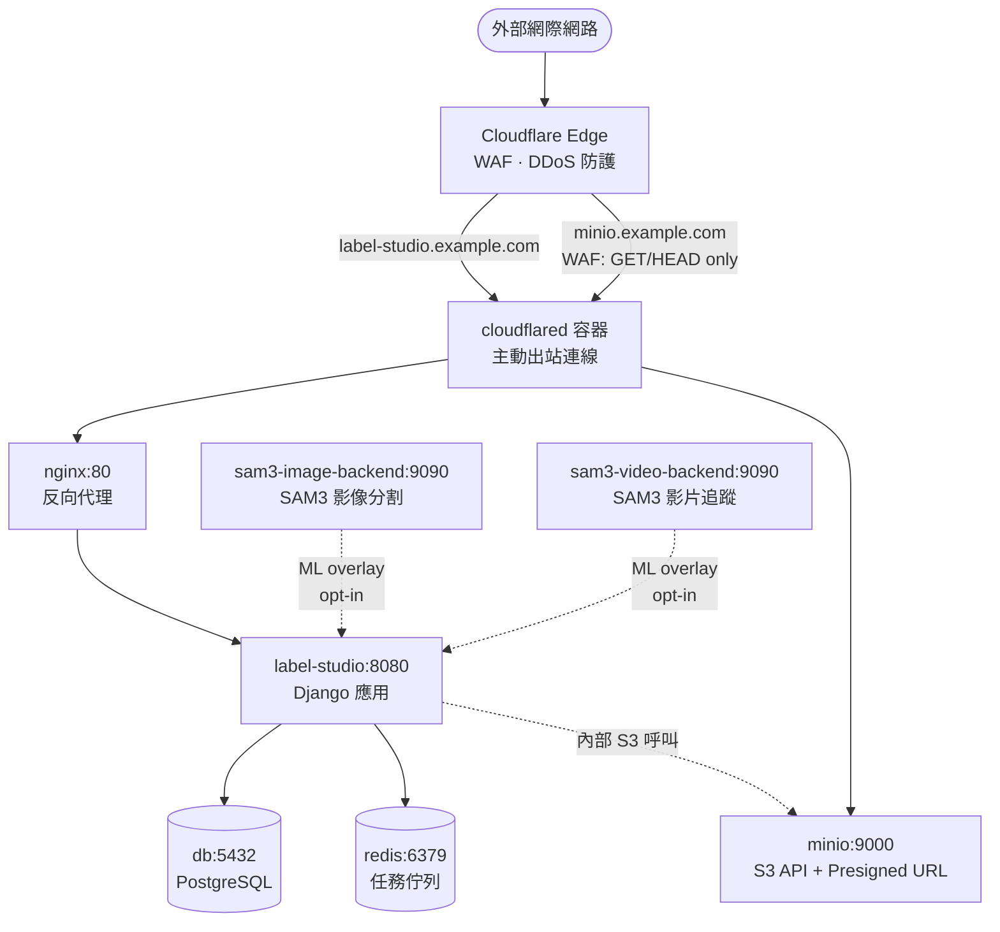
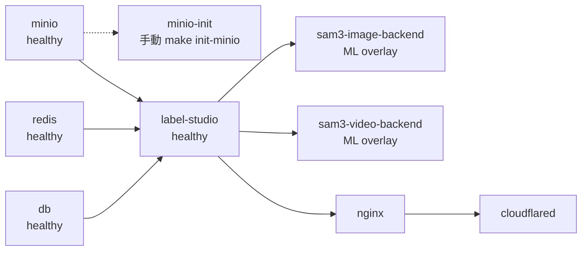
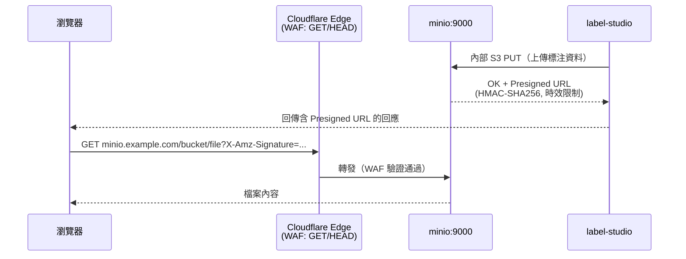

# 系統架構

## 服務拓撲



## 服務啟動相依關係



## Presigned URL 資料流



## Docker Volumes

| Volume / 路徑 | 類型 | 掛載服務 | 內容 |
|---------------|------|----------|------|
| `postgres-data` | named volume | db | PostgreSQL 資料檔 |
| `redis-data` | named volume | redis | Redis AOF / RDB |
| `minio-data` | named volume | minio | 物件儲存資料 |
| `./label-studio-data` | bind mount | label-studio | 媒體檔、匯出、上傳；host 端可直接觀察 |
| `hf-cache` | named volume | sam3-image-backend, sam3-video-backend | HuggingFace Hub 快取（`~/.cache/huggingface`） |
| `sam3-image-models` | named volume | sam3-image-backend | SAM3 影像模型權重（`/data/models`） |
| `sam3-video-models` | named volume | sam3-video-backend | SAM3 影片模型權重（`/data/models`） |

## 內部網路

所有服務共用 `internal` bridge 網路（`172.20.0.0/16`）。正式環境無任何埠號暴露於主機，所有流量由 cloudflared 進入。

本機開發（`docker-compose.override.yml`）額外暴露：

| 服務 | 主機埠號 |
|------|----------|
| nginx | 8090 |
| label-studio | 8085 |
| minio API | 19000 |
| minio console | 19001 |
| postgres | 5433 |
| redis | 6380 |

## SAM3 ML 疊加層

SAM3 後端為**選用疊加層**，定義於 `docker-compose.ml.yml`。兩個後端共用同一個 `internal` bridge 網路（由 base compose 建立，project name `label-studio`）：

```bash
make up       # 核心服務（不含 SAM3，無需 GPU）
make ml-up    # 核心服務 + SAM3 影像 + 影片後端（需 NVIDIA GPU）
make ml-down  # 停止所有服務（含核心 + SAM3）
```

`docker-compose.ml.yml` 不設定 `name:` 欄位，避免覆蓋 base project name 而造成網路隔離。

## 安全設計決策

| 決策 | 理由 |
|------|------|
| MinIO WAF：僅 GET/HEAD | Presigned URL 已有 HMAC 驗證；防止資料竄改與儲存桶列舉 |
| MinIO 不使用 CF Access | CF Access 會攔截 Presigned URL，破壞瀏覽器直接存取 |
| `SSRF_PROTECTION_ENABLED=false` | Label Studio 需呼叫內部 `minio:9000`；僅對可信內部網段放行 |
| 非 root 使用者（uid 1001） | SAM3 容器與 Label Studio 容器均以非 root 身份執行 |
